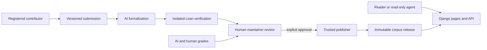

# Project architecture

This describes the intended full system. The design documents, example content,
a small [Lean project](../formal/README.md), and a first [web app](../app/README.md)
exist today. The web app implements read-only navigation and a sample HTML proof;
the account, review, publication, database, and worker components remain future work.

## Tools

| Layer | Initial choice | Purpose |
| --- | --- | --- |
| Web application | Python, Django, server-rendered templates | Public pages, registration, submission forms, review screens |
| Database | PostgreSQL | Accounts, drafts, jobs, reviews, publication pointers, searchable corpus projection |
| Human mathematics | HTML + LaTeX math | Entry-local, readable source, independent of the page layout |
| Equations | Pinned, self-hosted KaTeX | Accessible mathematical typesetting, loaded only on article pages |
| Images | PNG/WebP and sanitized SVG | Illustrations with captions, alt text, dimensions, and provenance |
| Formal mathematics | Lean 4, Lake, a pinned mathlib commit | Existing mathematical definitions and proof tooling, with explicit dependency policy |
| Published corpus | Git, JSON metadata, HTML, `.lean` sources | Reviewable changes and reproducible, downloadable releases |
| Background jobs | A dedicated Python worker and PostgreSQL job table | Durable, bounded formalization and verification jobs |
| Development | uv, Ruff, pytest, browser checks, CI | Locked Python dependencies and checks appropriate to each component |

Django already provides an ORM, templates, and an administrative interface, plus
authentication and permissions. Registration, email verification, and the specific
review workflow still need application code. See the official
[Django overview](https://docs.djangoproject.com/en/5.2/intro/overview/) and
[authentication documentation](https://docs.djangoproject.com/en/5.2/topics/auth/default/).

[KaTeX](https://katex.org/docs/browser) supplies the first site's LaTeX rendering,
with locally served fonts and accessible MathML output. It replaces the original
MathJax proposal for this lightweight first implementation. Specify a supported
math macro set; arbitrary LaTeX documents and TikZ are not browser input. Store
diagrams as image assets, retaining their source when available. Preview and
publication must use the same renderer.

Use [PostgreSQL full-text search](https://www.postgresql.org/docs/current/textsearch.html)
for titles, aliases, prose, and declaration names initially. Formula and semantic
search can follow. Do not add a separate search service or graph database yet.

Pin exact tool versions and dependency commits when the first runnable project
is created. Check those pins into the repository; do not build releases against
floating `latest` versions. mathlib and Lean must use compatible pins.

## Proposed folder layout

```text
lemmatheca/
├── README.md
├── docs/                           # Architecture, policies, baseline, contributor guide
├── app/
│   ├── manage.py
│   ├── config/                     # Django settings and root routes
│   ├── accounts/                   # Registration and selected maintainer roles
│   ├── catalog/                    # Taxonomy, entries, search, corpus import
│   ├── submissions/                # Drafts, upload and preview
│   ├── reviews/                    # Grades, decisions, audit history
│   ├── jobs/                       # Durable jobs, leases, retries, worker commands
│   ├── api/                        # Versioned, read-only corpus API
│   ├── templates/                  # Reader pages and maintainer screens
│   └── static/                     # Small stylesheet and pinned KaTeX assets
├── corpus/
│   ├── taxonomy.json
│   ├── reading-order.json          # Ordered entry IDs per area
│   ├── foundations.json            # Exact elementary declaration allowlist
│   ├── entries/<entry-id>/
│   │   ├── entry.json              # Compact metadata and block formal bindings
│   │   ├── entry.html              # Complete human note, including proofs and questions
│   │   └── assets/                 # Images and diagram source
│   └── releases/                   # Manifests naming Git snapshots
├── formal/
│   ├── lean-toolchain
│   ├── lakefile.toml
│   ├── lake-manifest.json
│   ├── Lemmatheca.lean
│   ├── Lemmatheca/
│   │   ├── Foundations/
│   │   ├── Algebra/
│   │   ├── Combinatorics/
│   │   │   ├── Additive/
│   │   │   └── Enumerative/
│   │   └── ...
│   └── Audit/                      # Declaration, dependency, and axiom extraction
├── workers/
│   ├── formalize/                  # Model adapter and bounded Lean repair loop
│   ├── verify/                     # Isolated builds and trusted report generation
│   └── grade/                      # Versioned rubrics and AI recommendations
├── schemas/                        # JSON Schema and API contracts
├── scripts/                        # Corpus validation, import, export, release tooling
├── tests/                          # Permissions, publication, worker and rendering checks
├── infra/                          # Reproducible worker images and deployment configuration
├── .github/workflows/              # Application, content and Lean CI
├── pyproject.toml
└── uv.lock
```

Use ordinary modules and a shared codebase. Separate processes are needed for
resource isolation; independently deployed microservices are not needed initially.
The [entry source layout](entry-sources.md) explains the implemented authoring
format and why entry folders and Lean modules need not mirror the browsing taxonomy.

## Storage and publication

Git is authoritative for published mathematical source. PostgreSQL is authoritative
for accounts, private drafts, jobs, reviews, and maintainer decisions.
Its public catalog tables are a rebuildable projection of a published release.
Store large images, build logs, and verification artifacts in object storage,
referenced by content hashes. Small seed illustrations can live in Git.

Avoid two competing editable copies of published mathematics. A web edit creates
a draft change. After review, a trusted publisher creates a corpus commit from
that exact content. A release records the corpus commit, formal source hashes,
toolchain and dependency pins, trust-policy version, and verification artifact.

Publication uses a durable outbox and an idempotent release ID. The publisher
verifies the approved manifest, writes the Git snapshot, imports its search
projection, and atomically changes the public release pointer. A failed step is
retried without publishing half a release. If the base changes in a way that
affects verification or reviewed content, rebuild and obtain a fresh decision.



The public website can remain available when Lean or AI workers are offline.
They process queued jobs; they never run during an ordinary page request.

## Minimal web interface

Use a quiet, single-column reading page, roughly 70 characters wide, with good
spacing and responsive equations. The initial routes are:

| Route | Page |
| --- | --- |
| `/` | Areas of mathematics and search |
| `/areas/<path>/` | Breadcrumbs, subareas, definitions, statements |
| `/entries/<id>/` | Human mathematics, proof choices, prerequisites |
| `/submit/` | Definition, new statement, or alternate proof submission |
| `/submissions/<id>/` | Author's draft, preview, job status, requested changes |
| `/review/` | Maintainer queue with prose/formal comparison and dependencies |

An entry starts with the definition or statement, explicit hypotheses, motivation,
and a readable proof. Offer collapsible sections for prerequisites, alternate
proofs, Lean code, dependency details, and review history. Display concise factual
labels such as “Formalization complete” and “2 statements pending.” A draft is visibly a
draft and excluded from the accepted catalog.

No application framework is needed in the browser. Start with links and HTML
forms; small JavaScript can handle previews and job-status refresh. Anonymous
reading requires no account. Registration gives submission rights, not grading
or publication rights.

Preserve math delimiters through HTML processing and sanitize rendered HTML.
Restrict math macros and links; disable executable embedded content. Validate image
types and sizes, sanitize SVG, and serve uploads from a non-executable asset origin.
Use captions and alt text; allow wide equations to scroll without breaking mobile
layout. Print styles should keep equations, proof text, and captions legible.

## Implementation sequence

1. **One trusted vertical slice.** Pin Lean/mathlib; formalize the sumset example;
   build the dependency/axiom report; render it from corpus files; have a maintainer
   explicitly accept the precise human/formal pair. No automatic acceptance.
2. **Small public library.** Implement Django catalog, stable IDs, taxonomy, search,
   draft registration/submission flow, permissions, preview, human reviews, and
   read-only JSON exports. Seed roughly 10–20 entries in two or three areas.
3. **AI assistance.** Add bounded translation/repair and grading workers, preserve
   authorship, expose failures and costs, and measure acceptance on the fixed seed
   collection. Human formalization remains available when automation fails.
4. **Broader coverage.** Extend the taxonomy, improve search and figures, add
   alternate proofs and reverse-dependency views, and rehearse toolchain upgrades.
5. **Later research agents.** Let agents read frozen releases and work privately.
   New results enter the public pipeline only through manual human submission and
   maintainer approval. Autonomous publication remains unavailable.

Before opening submissions, check that an AI or ordinary account cannot publish;
changing reviewed content invalidates approval; missing dependencies fail the
trust audit; worker timeouts do not block the site; and equations and images render
correctly on a narrow screen. Test backup restoration for both corpus and database.
